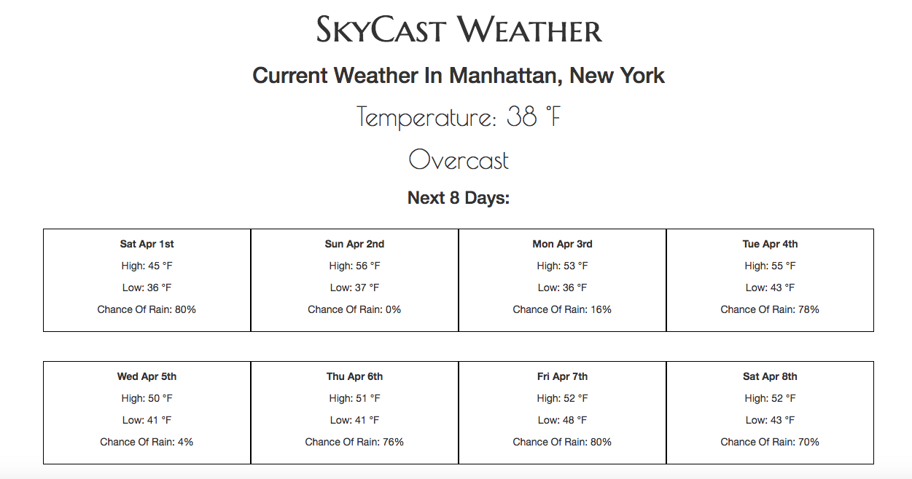

# SkyCast Weather App



## Link to Deployed

https://skycastdarksky.herokuapp.com/

## Description

Skycast weather app detects the user's location using Google Map Geolocation, and then returns the current weather as well as the weather forecast for the user's location. The user can also get weather information for any location by inputting an address. 

## Technologies Used

- [Darksky API](https://darksky.net/forecast/40.6441,-73.9779/us12/en)
- Google Maps Geolocate API
- Google Maps Geocoding API
- Axios
- Express
- Passport
- Sequelize
- Moment
- EJS

## Custom Middleware for Making API Calls
```javascript
//takes address from user input to output lat, long and neighborhood info
function geocodeCall (req, res, next) {
  //stores user input info in variable
  const address = req.body.address;
  axios.get(`https://maps.googleapis.com/maps/api/geocode/json?address=${address}&key=${process.env.MAP_KEY}`)
  .then((info) => {
    //store user location data returned from api call in res.locals
    res.locals.lat = info.data.results[0].geometry.location.lat;
    res.locals.lng = info.data.results[0].geometry.location.lng;
    res.locals.city = info.data.results[0].address_components[3].long_name;
    res.locals.neighborhood = info.data.results[0].address_components[2].long_name;

    return next();
  }).catch((err) => {
    console.log(err);
  });
}

//use data from geocodeCall funtion to plug into darksky api to get weather data for user's inputted location.
function darkSkyCall (req, res, next) {
  axios.get(`https://api.darksky.net/forecast/${process.env.WEATHER_KEY}/${res.locals.lat},${res.locals.lng}`)
  .then((weather) => {
    //store data returned from api call in res.locals
    //round temp to get rid of decimals for UX
      res.locals.temp = Math.round(weather.data.currently.temperature);
      res.locals.summary = weather.data.currently.summary;
      res.locals.forecast = weather.data.daily.data;
      return next();
     }).catch((err) => {
      console.log(err);
  });
}

//function to get weather data without user input to display on landing page
function geoLocateCall (req, res, next) {
  //use geolocate to get user location data from browser without user input
  axios.post(`https://www.googleapis.com/geolocation/v1/geolocate?key=${process.env.MAP_KEY}`)
  .then((response) => {
    //store lat and long data in variables
    const lat = response.data.location.lat;
    const lng = response.data.location.lng;
    //return second axios call to avoid double callback.
    return axios.get(`https://api.darksky.net/forecast/${process.env.WEATHER_KEY}/${lat},${lng}`)
    }).then((response) => {
      res.locals.temperature = Math.round(response.data.currently.temperature);
      res.locals.geolocatesum = response.data.currently.summary;
      res.locals.geoForecast = response.data.daily.data;
      return next();
    });
}
```
## Future Improvements

I would like to add more styling, including icons or background images reflecting the weather conditions. 

## Authors

Mimi Klein

